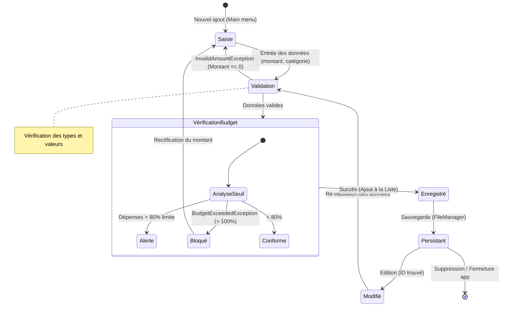

#  Member 3 – Service Layer (Student Budget Tracker)

Application console Java développée dans le cadre du cours de Programmation Orientée Objet.  
Ce module est responsable de la logique métier principale du système de gestion des dépenses.

Il permet de gérer les dépenses, les budgets et les opérations de recherche, filtrage et tri.

---

##  Contexte

Ce travail fait partie d’un projet POO collaboratif.  
Le rôle du Member 3 est de développer la couche service et la gestion des utilisateurs.

---

##  Fichiers développés

###  service/ExpenseManager.java
Classe principale du système (le "cerveau" de l’application)

Fonctionnalités :
- Ajouter / modifier / supprimer des dépenses
- Filtrer par catégorie et par mois
- Rechercher des dépenses
- Trier par date et montant
- Gérer les budgets
- Calculer les statistiques

Utilise :
- List<Expense>
- Map<String, Budget>
- Exceptions personnalisées
- Polymorphisme

---

###  model/Student.java
Représente un étudiant utilisateur du système.

Fonctionnalités :
- Stocker les informations utilisateur (id, nom, email, revenu)
- Conversion CSV (toCSV / fromCSV)
- Affichage formaté

---

##  Concepts POO utilisés

- Encapsulation
- Polymorphisme
- Classes abstraites
- Collections (ArrayList, HashMap)
- Gestion des exceptions
- Manipulation des chaînes de caractères

---

## 🔗 Dépendances

Ce module utilise :

- Expense (classe abstraite)
- Budget
- Alertable (interface)
- Exceptions personnalisées

---

##  Exemple d’utilisation

```java
ExpenseManager manager = new ExpenseManager();

manager.setBudget("food", 1000, 6, 2026);
manager.addExpense(expense);

manager.search("pizza");
manager.sortByAmount();
manager.listAll();
```

---

##  Objectif du module

Ce module sert de noyau logique du système et permet de :

- Contrôler les dépenses
- Gérer les budgets
- Fournir des analyses financières
- Connecter les données avec les autres modules du projet

---
##  Diagramme d’état

###  Version image (PNG)


---

###  Version Mermaid (logique système)


##  Auteur

ahmed mounir ahrabar  – ENSAM OOP Java Project